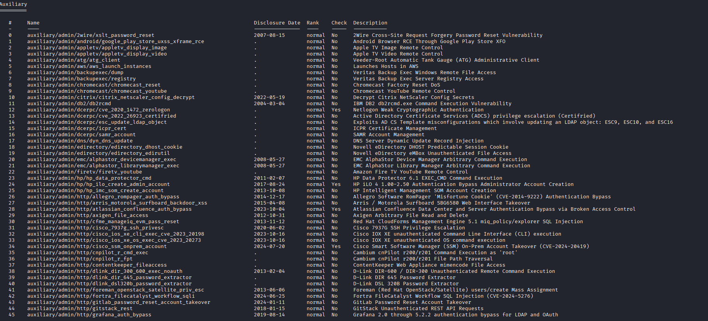
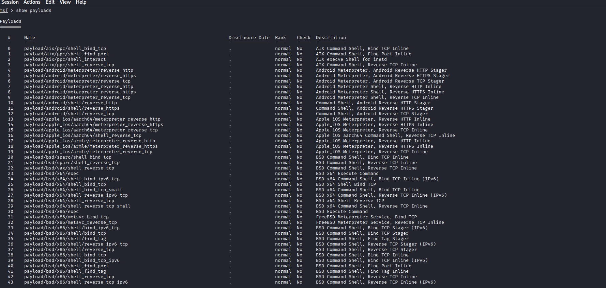
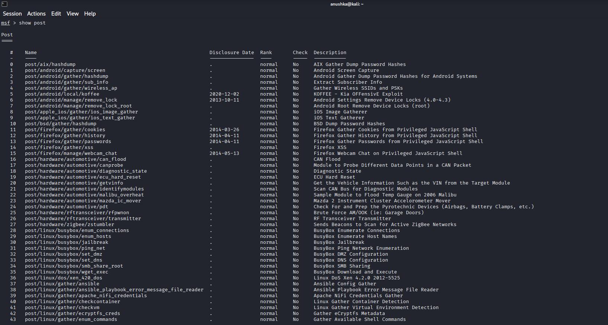
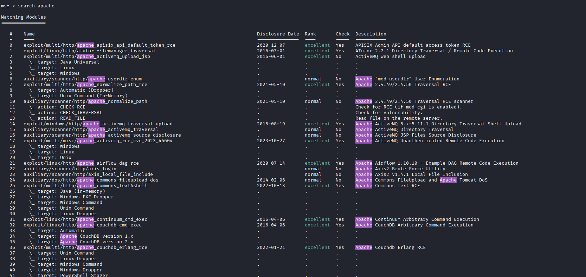
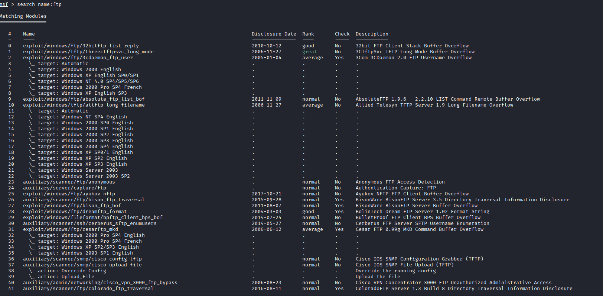
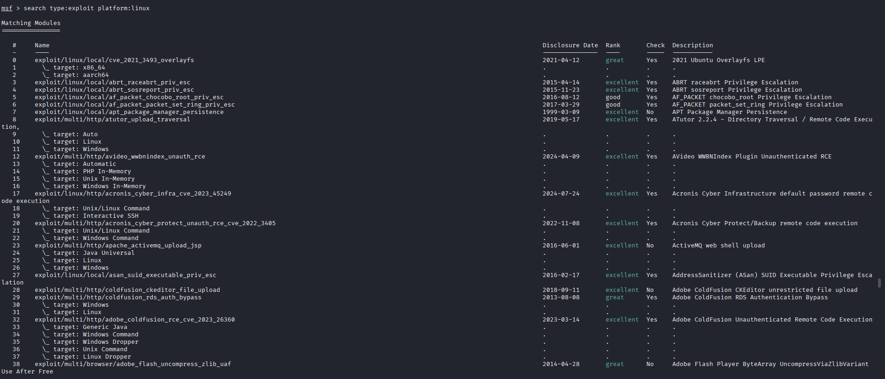
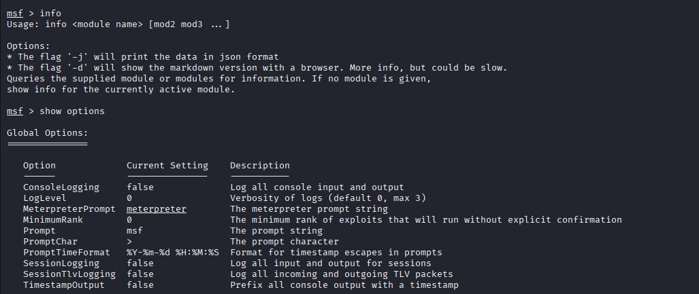
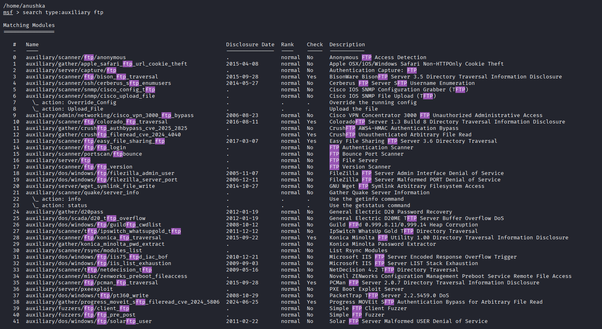
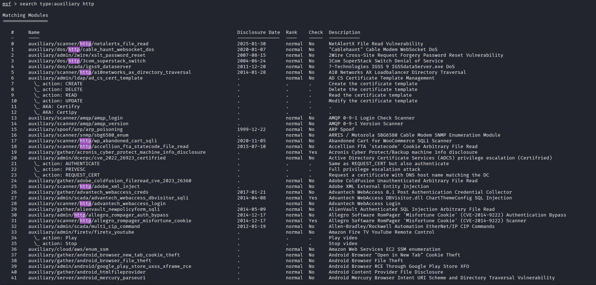
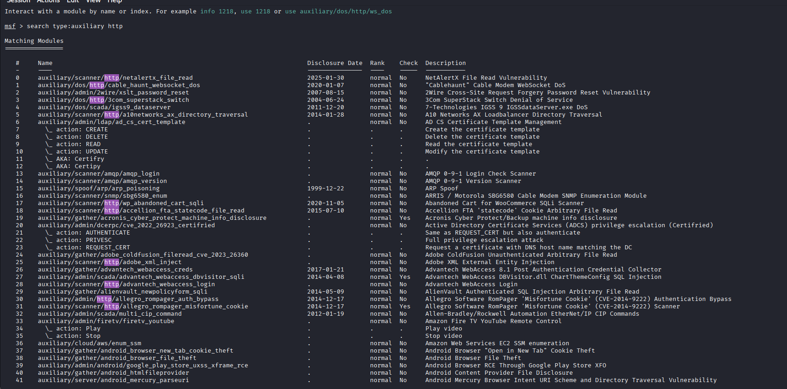

# Metasploit Practical 🛡️

## 🎯 Objective

To understand the Metasploit Framework and learn how it is
used for authorized security testing and vulnerability
assessment in a controlled lab environment.

## 🛠️ Tools Used

- Metasploit Framework
- Kali Linux
- Nmap

## 🔍 Topics Covered

- Metasploit Framework basics
- Searching modules
- Exploit modules
- Auxiliary modules
- Payloads
- Setting module options
- Using `show options`
- Using `info`
- Controlled vulnerability testing

## 💻 Basic Metasploit Commands

```text
msfconsole
search <keyword>
use <module>
info
show options
set <option> <value>
run
back
exit
## 📸 Screenshots

```
### Metasploit Practical 1


### Metasploit Practical 2
















### Metasploit Practical 10


### Metasploit Practical 11


### Metasploit Practical 12


